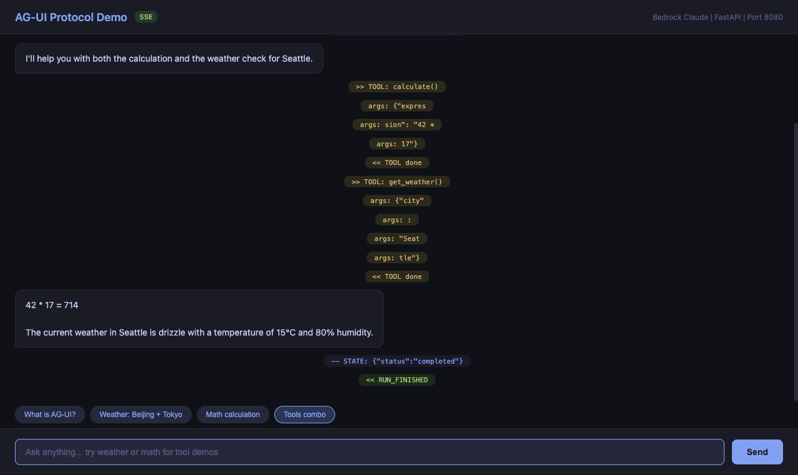
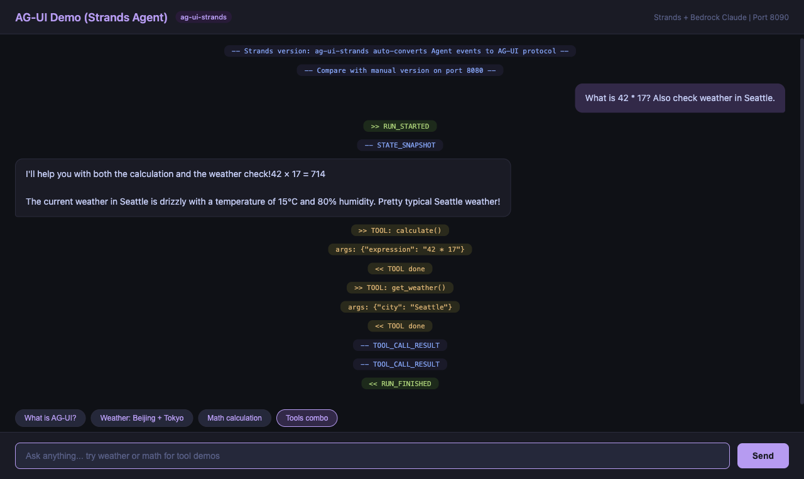

# AG-UI Protocol Demo

Two implementations of the **AG-UI (Agent-User Interaction)** protocol,
demonstrating the difference between manual and framework-based approaches.

AG-UI is an open, event-based protocol (by [CopilotKit](https://docs.ag-ui.com))
that standardizes how AI agents communicate with user-facing frontends.

## Demo Screenshots

### Demo 1: Manual Implementation (port 8080)

Pure FastAPI + boto3. Manually constructs AG-UI SSE events from Bedrock `converse_stream`.



### Demo 2: Strands Agent + ag-ui-strands (port 8090)

One-line `StrandsAgent()` wrapper auto-converts Agent events to AG-UI protocol.



Both demos show the same scenario: multi-tool invocation (calculate + weather) with
real-time AG-UI event streaming visible in the UI.

## Prerequisites

- Python 3.12+
- AWS credentials configured (for Bedrock Claude access)
- AWS region `us-west-2` with Claude Sonnet model access

## Quick Start

### Demo 1: Manual Implementation

```bash
pip install fastapi uvicorn boto3
python agui_server.py
# Open http://localhost:8080
```

### Demo 2: Strands Agent + ag-ui-strands

```bash
python -m venv .venv && source .venv/bin/activate
pip install fastapi uvicorn ag-ui-strands strands-agents
python agui_server_strands.py
# Open http://localhost:8090
```

## Code Comparison

### Manual version (~300 lines)

You handle everything: SSE formatting, Bedrock stream parsing, multi-turn
tool loop, state management.

```python
yield f'data: {{"type":"RUN_STARTED","runId":"{run_id}"}}\n\n'
yield f'data: {{"type":"TEXT_MESSAGE_CONTENT","delta":"{chunk}"}}\n\n'
yield f'data: {{"type":"TOOL_CALL_START","toolCallName":"{name}"}}\n\n'
# ... parse converse_stream, execute tools, loop back ...
yield f'data: {{"type":"RUN_FINISHED","runId":"{run_id}"}}\n\n'
```

### Strands version (~100 lines)

One-line wrapper handles all AG-UI event conversion automatically.

```python
agui_agent = StrandsAgent(agent=strands_agent, name="demo")

async for event in agui_agent.run(run_input):
    yield encoder.encode(event)
```

## AG-UI Event Flow

Both produce standard AG-UI events:

```
RUN_STARTED
  STATE_SNAPSHOT
  TOOL_CALL_START (get_weather)
    TOOL_CALL_ARGS
  TOOL_CALL_END
  TOOL_CALL_RESULT          <-- Strands version adds this automatically
  TEXT_MESSAGE_START
    TEXT_MESSAGE_CONTENT x N
  TEXT_MESSAGE_END
RUN_FINISHED
```

## Deploy to AgentCore Runtime

```bash
pip install bedrock-agentcore-starter-toolkit uv

agentcore configure -e agui_server_strands.py \
  --protocol AGUI --region us-west-2 \
  -ni -dt direct_code_deploy --runtime PYTHON_3_13

agentcore deploy
agentcore destroy  # cleanup
```

## Security Notes

- CORS is fully open (`*`) for local demo purposes. Restrict in production.
- The server binds to `0.0.0.0` for convenience. Use `127.0.0.1` in production.
- The `calculate` tool uses AST-based safe evaluation (no `eval()`).
- Error messages shown to users are generic and do not leak internal details.

## License

MIT
